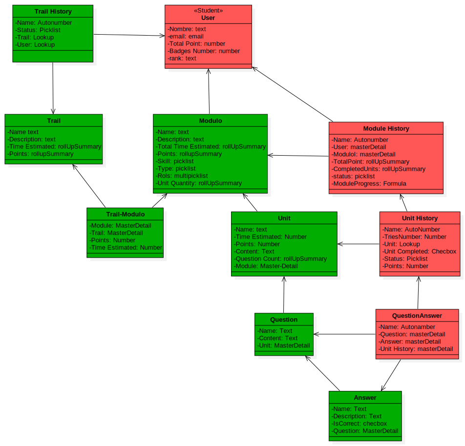
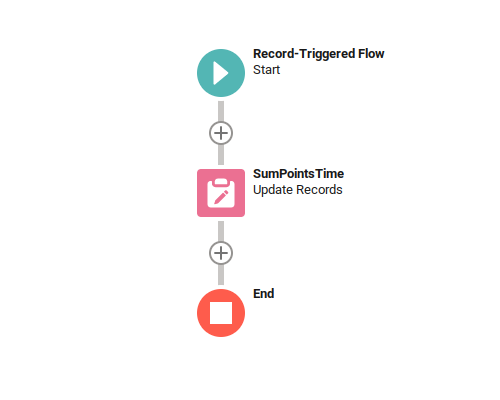
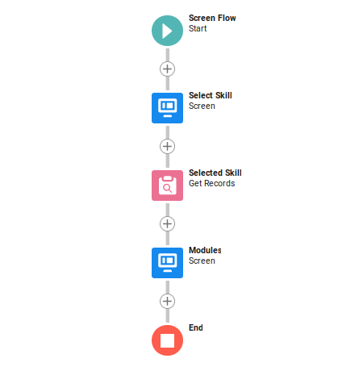
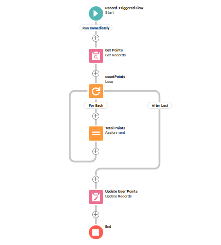
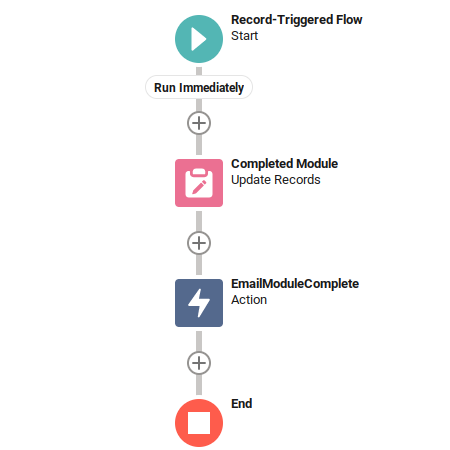
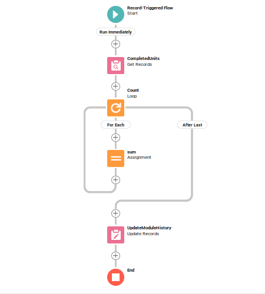

# Project Pair Programming P5 E-Learning

## Table of Content

- [Members](#members)
- [Data Model](#data-model)
- [Flows](#flows)
    - [Trail Module Point in Time](#trail-module-point-in-time)
    - [Skill Skeleton](#skill-skeleton)
    - [Rollup Summary Total User Point](#rollup-summary-total-user-point)
    - [Email Module History](#email-module-history)
    - [Sum of Completed Units from Module History](#sum-of-completed-units-from-module-history)

## Members

- Johan Revilla
- Alan Duran

## Data Model

## Flows

### Trail Module Point in Time

Since it is not possible to do a rollup summary from child to parent, this flow is
an assistant.
I transfer the data of Points, Time and number of units from the
Modulo object to TrailModulo, to then be able to rollup
summary from Trail to TrailModulo getting the necessary information to
total the points, time and number of units of each Trail.

### Skill Skeleton

This Screen Flow allows you to select a skill and from the selection
show modules associated with that skill.

### Rollup Summary Total User Point

According to the Salesforce documentation, the standard User object cannot
be part of a master-detail relationship, this way we don't have
the option of making a RollUp Summary is available, so it is resolved
with this flow. The sum of points of a user is obtained
determined from ModuleHistory.

### Email Module History

Send an email and update the status of the module to Completed, at the end of it.

### Sum of Completed Units from Module History

Calculate the number of units completed for each module.

